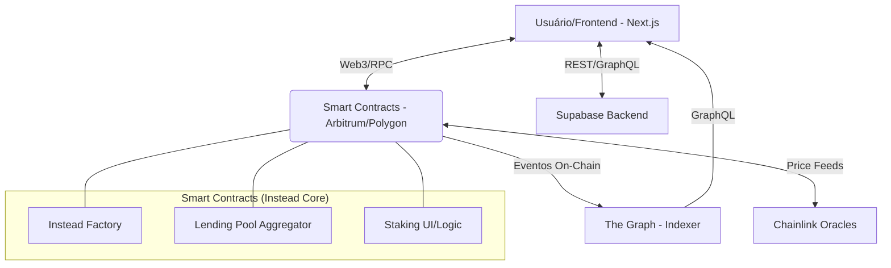

# Arquitetura Técnica: Plataforma "Instead" (DeFi Lending & Token Factory)

## 1. Visão Geral do Sistema
A plataforma **Instead** é um ecossistema DeFi completo construído com o objetivo de democratizar o acesso a empréstimos colateralizados e à criação de tokens (Tokenomics as a Service).

A stack tecnológica principal consiste em:
- **Blockchain (L2 Sugerida)**: Arbitrum (Ethereum L2) ou Polygon. Oferecem compatibilidade 100% com EVM, segurança atrelada ao Ethereum e taxas de transação baixíssimas.
- **Smart Contracts**: Solidity ^0.8.20, utilizando frameworks como Hardhat ou Foundry. Padrão OpenZeppelin para segurança (ERC20, ReentrancyGuard, Pausable, UUPSUpgradeable).
- **Frontend**: Next.js (React), TailwindCSS, Wagmi/Viem (para interação Web3) e RainbowKit para conexão de wallets.
- **Backend/Off-chain**: Supabase (PostgreSQL, Auth, Edge Functions) para armazenar metadados de tokens, histórico de usuários off-chain, cache de requisições UI, e The Graph (Subgraph) para indexar eventos on-chain.

## 2. Diagrama de Arquitetura

## 3. Componentes do Sistema (Smart Contracts)

### 3.1 Crypto Lending (Empréstimos)
- **Pool de Liquidez Isolada ou Compartilhada**: Permite que usuários depositem tokens (Ex: USDC, ETH) e recebam yield baseado na utilização do pool.
- **Taxa de Juros Algorítmica**: O modelo de juros segue uma curva de utilização matemática. Quanto mais capital emprestado, maior a taxa cobrada do devedor e paga ao credor.
- **Oráculos Chainlink**: Usados em tempo real na função de `borrow()` e `liquidate()` para garantir que o valor do colateral em USD seja suficiente para manter o LTV (Loan-To-Value) saudável.

### 3.2 Token Factory (No-Code Generator)
- **Contrato Factory**: Um contrato que cobra uma taxa (em ETH/MATIC ou token nativo) e realiza o deploy de um novo contrato ERC20 customizado.
- **Opções Suportadas**:
  - ERC20 Padrão.
  - ERC20 Mintable (Dono pode gerar mais).
  - ERC20 Burnable (Usuários podem queimar).
  - ERC20 com Taxa (Ex: 2% retido para a treasury a cada transferência).

### 3.3 Segurança e Upgrades
- Todos os contratos utilizam a arquitetura Proxy (Padrão UUPS) para serem atualizáveis.
- O controle dos administradores é gerenciado através de Gnosis Safe (Multi-sig Wallet), evitando ponto único de falha.
- Pausable (Circuit breakers): Em caso de vulnerabilidade, o sistema pode ser pausado para depósitos e empréstimos, permitindo apenas saques.

## 4. Integração Supabase (Web2.5)
O Supabase atua como a ponte de aceleração (Cache) da plataforma:
1. **Perfis de Usuário**: Associa o endereço da wallet a um perfil de usuário (nome, avatar, preferências).
2. **Tokens Criados**: O Supabase indexa metadados dos tokens gerados na Factory para que o site carregue instantaneamente sem onerar chamadas RPC.
3. **Notificações**: Pode alertar usuários quando seus empréstimos estão próximos da zona de liquidação usando Edge Functions + SendGrid/Push.
